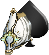
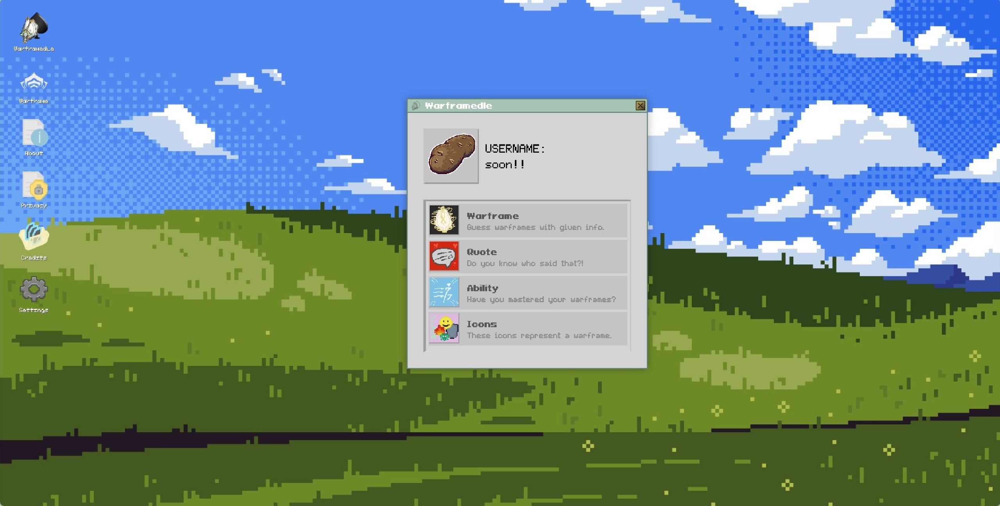
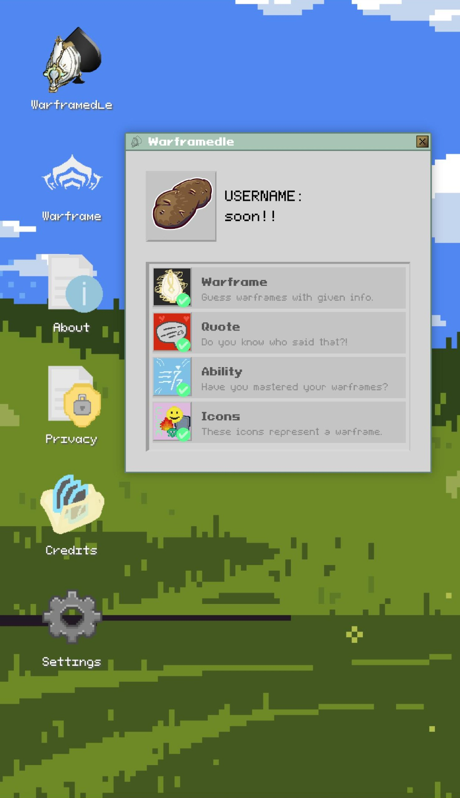

# Warframedle 🎮

A Warframe-themed daily guessing game to test tenno knowledge in the game.

it's inspired by the amazing loldle game.

## 🚀 Tech Stack
- **Frontend:** React Native, Vite and React Router.
- **Backend:** Firebase (Realtime DB, Functions, Analytics), Node.js.
- **Styling:** Custom retro CSS, Pixeloid fonts.
- **Audio:** Howler.js, Web Audio API.

## ✨ Features
- KIM system themed draggable windows.
- 4 games to play, guess warframe, quote, aboility and icons.
- Daily reset challenge with streak system and statistics.
- Responsive + mobile-friendly
- Two view modes, fullscreen and windowed to fit most screens and a colorblind mode.

## 📸 Main Menu

## 🎥 Video showcase of the project
[▶️ Watch on YouTube](https://www.youtube.com/shorts/SKyKVzbceIQ)

## 🔗 Go play it yourself at
👉 [warframedle.com](https://warframedle.com)